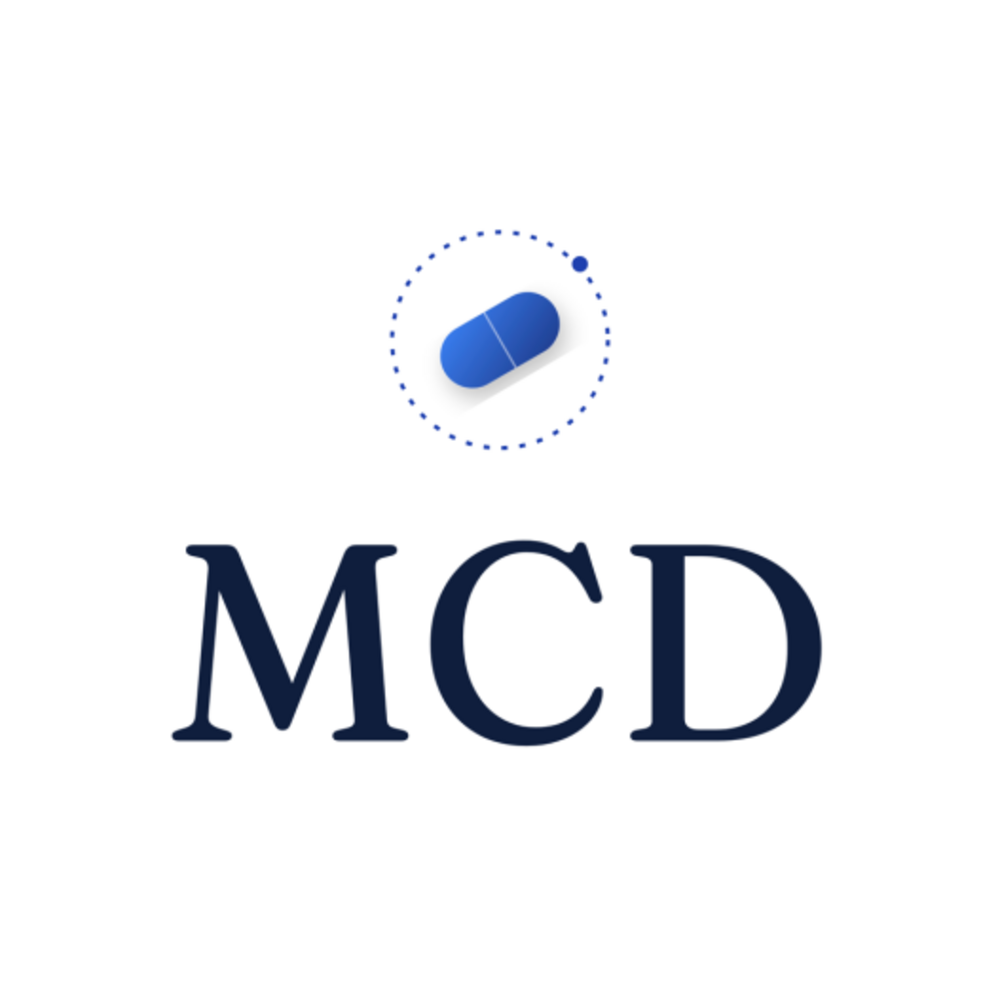

# MCD — Platanus Hack 26: Buenos Aires



**Track:** 🗼 Vertical AI

**Team:**
- Martín Lecam ([@MartinLecam](https://github.com/MartinLecam))
- Delfina Young ([@youngdelfi](https://github.com/youngdelfi))
- Candela Cabido ([@knd-ds](https://github.com/knd-ds))

---

## What is MCD?

MCD replaces CRO (Contract Research Organizations) for pharmaceutical labs. Labs traditionally pay CROs millions to collect patient adherence data through slow, manual fieldwork. MCD creates a direct data pipeline from patient to lab — using WhatsApp, the channel patients already use, powered by AI agents.

**The full loop:**
1. Doctor loads a patient (name, phone, drug) into the dashboard → DB status `pending`
2. Patient messages the WhatsApp bot → AI questionnaire begins
3. A symptom agent conducts a dynamic LLM interview, adapting questions to each response
4. An image agent (Claude Vision) analyzes photos sent by the patient — detecting clinical signals like *Ozempic Face*, injection site reactions, or dehydration
5. Every response is saved with structured analysis: symptoms, alert level, adherence signal
6. Non-responsive patients (no reply in 48h) are flagged RED automatically
7. The lab generates a cohort report with one click: adherence rate, top side effects, alerts, per-patient summaries

---

## Architecture

```
                    ┌─────────────────────────────────┐
                    │          LABORATORY              │
                    │  (pays doctor, wants adherence)  │
                    └───────────────┬─────────────────┘
                                    │ consumes
                    ┌───────────────▼─────────────────┐
                    │         CRO Agent               │
                    │  Lab reports dashboard (Lovable) │
                    │  aggregates patients → report   │
                    └──┬───────────────┬──────────────┘
                       │               │
          ┌────────────▼───┐   ┌───────▼──────────┐
          │  mcd-doctor    │   │  WhatsApp Bot    │
          │  (Next.js)     │   │  multi-agent     │
          │  CRUD patients │   │  questionnaire   │
          │  sees status   │   │  + image vision  │
          └────────────────┘   └──────────────────┘
```

---

## Services

| Service | URL |
|---|---|
| WhatsApp Bot API | https://platanus-hack-26-ar-team-1-production.up.railway.app |
| Doctor Dashboard | https://mcd-doctor-production.up.railway.app |
| Lab Reports Dashboard | https://cohort-care-preview.lovable.app/ |

---

## Stack

| Layer | Technology |
|---|---|
| Bot runtime | Python (Flask + Waitress) on Railway |
| WhatsApp connectivity | Kapso proxy + Meta Graph API |
| AI agents | Claude API — `claude-sonnet-4-6` |
| Database | Supabase (PostgreSQL) |
| Media storage | Supabase Storage |
| Doctor dashboard | Next.js on Railway |
| Lab dashboard | React (Lovable) |

---

## Agent Pipeline

Each inbound WhatsApp message goes through:

```
inbound message
    ↓
[media upload → Supabase Storage if image/audio/video]
    ↓
[Image Agent] ← if message is an image
    Claude Vision + Ozempic visual knowledge base
    → observations, relevant_signals, alert_level
    ↓
[Symptom Agent] ← always
    Ozempic clinical knowledge base
    → symptoms_noted, adherence_signal, overall_alert_level, next_message
    critical fast path: self-harm keywords → immediate escalation
    ↓
[save to DB] full structured analysis (JSONB) → conversations table
    ↓
[send reply via Kapso]
```

---

## Patient State Machine

```
pending
  ├── [patient messages bot]  → in_progress
  │     └── [≥3 exchanges, all areas covered] → completed
  └── [48h no reply]          → non_responsive  ← flagged RED
```

---

## Repository Structure

```
platanus-hack-26-ar-team-1/
├── mcd/                        # WhatsApp bot (Python/Flask)
│   ├── app.py                  # Flask app + webhook + admin endpoints
│   ├── core.py                 # Message parsing and routing
│   ├── agents/
│   │   ├── image_agent.py      # Claude Vision analysis
│   │   ├── symptom_agent.py    # LLM interview + next question
│   │   └── knowledge/
│   │       └── ozempic_knowledge.py  # Clinical knowledge base
│   ├── flows/
│   │   └── questionnaire_flow.py     # Agent orchestration
│   ├── database/
│   │   └── supabase.py         # All DB operations
│   ├── integrations/
│   │   └── whatsapp.py         # Kapso API (send, download, media)
│   └── utils/
│       └── storage.py          # Media upload to Supabase Storage
├── mcd-doctor/                 # Doctor dashboard (Next.js)
├── mcd-dashboard/              # Lab reports dashboard (Lovable/React)
├── project-logo.png
├── project-description.md
└── platanus-hack-project.json
```
